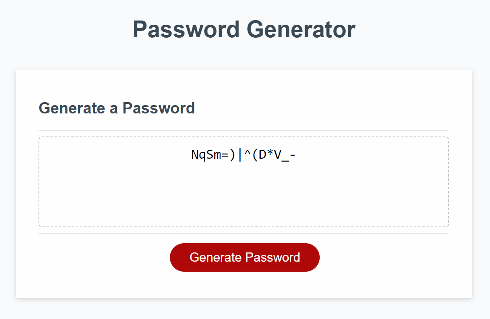

# Password Generator Starter Code

This password generator is a simple program that generates a random password based on user-selected criteria. This app will run in the browser and features dynamically updated HTML and CSS powered by JavaScript code. It has a clean and polished user interface and is responsive, ensuring that it adapts to multiple screen sizes.      
Password-generator will accept 8 to 128 chracters in length based on the Users input to the prompts.  If the User does not input anything at this prompt the default value of 8 will be generated. The password will contain at least one character type selected by the user. The user will be able to select which character types to include in the password.